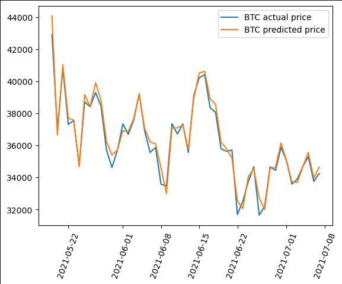

# Final Stats102 project - Cryptocurrency

## 1. Team: 

- Nizar Talty (nizar.talty@duke.edu) 
- Hung Nguyen (hung.q.nguyen@duke.edu)
- Sara Kojic (sara.kojic@duke.edu)

## 2. Individual Contribution 
1. Sara Kojic:
    - NFT Prediction (Linear regression)
    - Time Series Analysis
    - ETH/Solana
2. Nizar Talty:
    - Linear regression, KNN Regression, Decision Tree.
    - Features Selection Implementation
    - BTC/ETH & BTC/LTC correlation
3. Henry Nguyen:
    - Research on potential relation between cyptocurrencies
    - Data collection
    - Relation between the number of tweets and BTC Prices

## 3. Contents:

1. main.ipynb
    - Linear Regression Model for predicting the Bitcoin price
    - Bitcoin and Ethereum correlation, Bitcoin and Litecoin correlation
    - Linear Regression Model for predicting the price of Bitcoin using Ethereum
    - Linear Regression Model for predicting the price of Bitcoin using Litecoin
    - ARIMA time series analysis for Bitcoin
    - KNN Model for predicting the Bitcoin price
    - Tree-Based Model for predicting the Bitcoin price
2. tweet1.ipynb
    - Predicting Bitcoin price using the number of tweets (Linear Regression)
3. eth-solana.ipynb
    - predicting Ethereum price using Solana price (Linear Regression)
4. nft.ipynb
    - Prediction of Ethereum price using NFT data (Linear Regression)
    - Time series analysis of Ethereum price (ARIMA,Prophet)
5. eth_sequential
    *Note this uses the same datasets that are used in other files (coin_Ethereum.csv,coin_Bitcoin.csv) but the file path is different as it was done in Google Colab
    - Time series analysis of Ethereum price (Keras Sequential Model)
6. utils.py 
    -backward and forward step-wise selection used in other files

## 4. Our project:

### 4.1. Linear Regression
First, both forward and backward stepwise selection provide appropriate features for the best model to predict the price. High, Low, Open and Marketcap for BTC are amongst the best features, while others such as the number of tweets are not reliable predictors. 

This graph shows the last 50 days of **Prediction versus the actual price for BTC** after the feature selection. 
Features used: ['High', 'Low', 'Open', 'Marketcap']

With the same approach we tested it for ETH. 
Features used: ['High', 'Low', 'Open']

### 4.2. KNN regression & Decision Tree
Both KNN and Decision trees seems to give good results with a score over 0.9

### 4.3. Correlation between Cryptocurrencies: BTC/LTC and BTC/ETH
In this section, we explored the potential relation or correlation between cryptocurrencies. After studying the correlation matrix, and doing feature selection on a dataset that contains both the parameters of BTC and ETH for example, we found that it did pick the close price of ETH and the Marketcap of BTC. Same thing goes for the LTC/BTC correlation. 

   Backward: (55258743.705028124, 0.9181782279857733, (LinearRegression(), 55258743.705028124, ['Close_ETH', 'Marketcap'])  
   Forward: (55258743.705028094, 0.9181782279857801, (LinearRegression(), 55258743.705028094, ['Marketcap', 'Close_ETH']))  

This graph shows the **Predicted Price VS. the actual Price** with 'Close_ETH', 'Marketcap' features, and we can see it'is more accurate than previous results in this time range.

This graph also shows the strong relation between the prices through correlation

### 4.4. Predicting ETH price using NFT parameters
It is known that ETH is widely used for NFT transactions, this causes a correlation between their factors. So we tried to predict ETH price using NFT. 
With features selection, we found that *'High', 'Low', 'Open', 'Marketcap', 'Primary_Sales_cumsum', 'AverageUSD_cum'* are the optimal features for that end. 
Through the following graph that the results are quit positive.

However, when trying to predict the ETH closing price using only NFT indicators, we were less succesful. But the prediction somehow follow the trend of the prices (when it goes down and up) as shown in the following plot:

### 4.5. Relation between BTC tweets and prices
Our objective was to determine if a model with the number of tweets about BTC could predict with confidence the prices. However we found that the precision is very poor, and concluded that there is no specific or evident relation between them the **number** of tweets and the price, as shown below.

### 4.6. Graphs
We used multiple graphs to track the prices and one one them using plotly allow us to see the prices but also be able to focus on one part using candlesticks.

## 5 Design and Implementation

We use three different datasets from Kaggle featuring cryptocurrcies prices, NFTs and Bitcoin-related tweets data to conduct our analysis. 
However, for simplifying and making the dataset lighter, the Twitter data set was converted to another CSV file that contains only the number of tweets about BTC.

  
    ### 5.1 Predictions Using Predictors
  
    
   ### 5.2 Time series analysis
We also tried implementing Time Series Analysis using Prohet and Arima packages  

   ### 5.3 Graphs and Plots
For this objective we used matplolib and plotly packages

## 6. Conclusions 

Past research has shown a positive correlation between Bitcoin’s price and other cryptocurrencies, including Litecoin, Ethereum, Ripple and Dash (Li, 2019; Shi et al., 2020). Using price values data from 2013-2021, our research, through linear regression and time series analysis,  yields similar results: the close price of Litecoin and Etherum could be reliable predictors for Bitcoin’s prices, indicating a close correlation between these cryptocurrencies. 

## 7. References

Li, K. (2019, July 23). You Don’t Need a Diversified Crypto Portfolio to Spread Risk: Here’s Why. Medium. Retrieved October 19, 2022, from https://towardsdatascience.com/bitcoin-dominance-5a95f0f3319e

Shi, Y., Tiwari, A. K., Gozgor, G., & Lu, Z. (2020). Correlations among cryptocurrencies: Evidence from multivariate factor stochastic volatility model. Research in International Business and Finance, 53, 101231.

https://www.youtube.com/watch?v=GFSiL6zEZF0